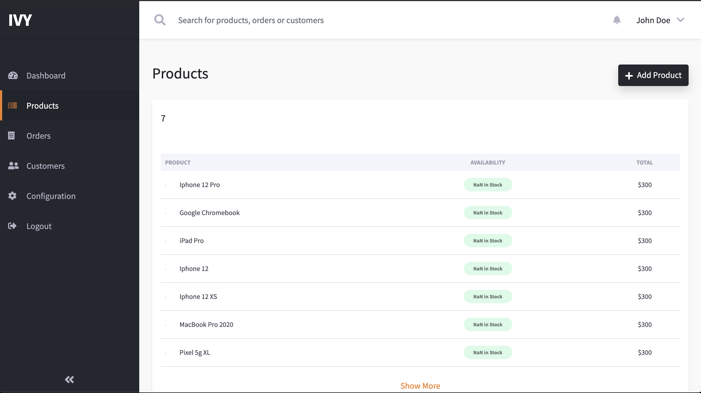

# Project 2 - IVY
# Description
This project is called IVY made to make users like managers, employees and customer to be able to use the app so they can manage employees, manage orders and make an order.

This app is used in management to see the placed orders of the customers and collect the information of the customer and send the orders to them. 

Here are some photos of the deployed project:

This photo shows the list of products available in the website

This photo shows the orders that have been placed and the details of the order that has been made.

This shows the list of customers who signed up in the website

To view the deployed website of this project you can view it [here](https://ivy-inventory-management.herokuapp.com/).
# Table Of Contents

  * [Description](#description)
  * [Installation](#installation)
  * [Usage](#usage)
  * [License](#license)
  * [Contributing](#contributing)
  * [Tests](#tests)
  * [Questions](#questions)
  
# Installation
npm install
# Usage
npm start
# Licence 
APACHE
# Contributors
Kevin, Ben, Grace & Andy
# Test 

# Questions 
Please don't hesitate to ask questions you can email us.